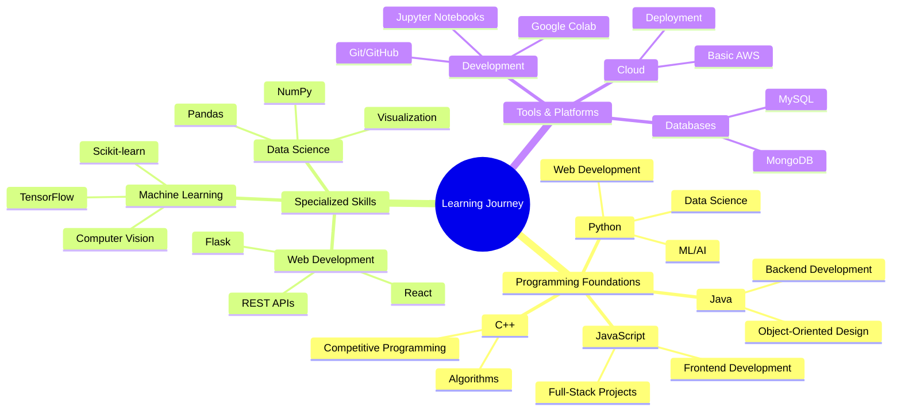

##🎯Final Year CSE Student | AI Engineer & Data Science Practitioner | Building Intelligent Systems

<div align="center">

```ascii
╭─────────────────────────────────────────────────────────────────────────────────────╮
│  ██╗   ██╗ █████╗ ███████╗██╗  ██╗    ███╗   ███╗███████╗██╗  ██╗████████╗ █████╗  │
│  ╚██╗ ██╔╝██╔══██╗██╔════╝██║  ██║    ████╗ ████║██╔════╝██║  ██║╚══██╔══╝██╔══██╗ │
│   ╚████╔╝ ███████║███████╗███████║    ██╔████╔██║█████╗  ███████║   ██║   ███████║ │
│    ╚██╔╝  ██╔══██║╚════██║██╔══██║    ██║╚██╔╝██║██╔══╝  ██╔══██║   ██║   ██╔══██║ │
│     ██║   ██║  ██║███████║██║  ██║    ██║ ╚═╝ ██║███████╗██║  ██║   ██║   ██║  ██║ │
│     ╚═╝   ╚═╝  ╚═╝╚══════╝╚═╝  ╚═╝    ╚═╝     ╚═╝╚══════╝╚═╝  ╚═╝   ╚═╝   ╚═╝  ╚═╝ │
╰─────────────────────────────────────────────────────────────────────────────────────╯
```


[](https://github.com/YashM-235)
[](https://github.com/YashM-235)
[](https://linkedin.com/in/yash-mehta-402239163)

</div>

---

## 🎖️ **ABOUT ME**

<div align="center">
  
</div>

> **Passionate Computer Science student** with a love for building innovative solutions and exploring cutting-edge technologies. Currently in my final year at Bennett University with hands-on experience in **AI/ML projects**, **full-stack development**, and **research**. Eager to contribute to impactful projects and learn from industry experts.

```python
class YashMehta:
    def __init__(self):
        self.status = "Final Year CSE Student"
        self.graduation = "2026"
        self.passion = [
            "Machine Learning & AI",
            "Full-Stack Development", 
            "Research & Innovation",
            "Problem Solving"
        ]
        self.achievements = {
            "projects_built": 15,
            "hackathon_wins": 1,
            "certifications": 6,
            "research_papers": 2
        }
        
    def career_goal(self):
        return "Building the future through code and innovation! 🚀"
```

---

## 🏢 **TECHNICAL SKILLS & LEARNING JOURNEY**

<div align="center">

| **Domain** | **Proficiency** | **Key Technologies** | **Learning Since** |
|------------|-----------------|---------------------|-------------------|
| **Machine Learning** | ████████████████▓▓▓▓ | TensorFlow, Scikit-learn, PyTorch | 2023 |
| **Full-Stack Development** | ████████████████▓▓▓▓ | Flask, React, REST APIs | 2022 |
| **Data Science** | ██████████████▓▓▓▓▓▓ | Pandas, NumPy, Matplotlib | 2023 |
| **Programming** | ████████████████████ | Python, Java, C++, JavaScript | 2022 |
| **Web Technologies** | ██████████████▓▓▓▓▓▓ | HTML/CSS, MySQL, MongoDB | 2022 |
| **Research & Analysis** | ████████████████▓▓▓▓ | Academic Writing, Experimentation | 2024 |

</div>

---

## 🏆 **FEATURED PROJECTS & ACHIEVEMENTS**

### 🔮 **Amazon Stock Prediction System** | *Time Series Forecasting*


**Advanced ML Project for Financial Prediction**

• **Innovation**: Built hybrid ensemble combining 7 different models (ARIMA, LSTM, GRU, Prophet, Transformers)  
• **Achievement**: Custom TimeSeriesTransformer achieving impressive RMSE of 0.03285  
• **Learning**: Deep dive into time series analysis, model ensembling, and financial data  
• **Tech Stack**: Python, TensorFlow, Pandas, Flask, data visualization  
• **Outcome**: Comprehensive understanding of production ML pipelines  

<details>
<summary><b>🔬 What I Learned & Built</b></summary>

```python
class TimeSeriesTransformer(nn.Module):
    """
    My custom transformer architecture for stock prediction
    Learned about attention mechanisms and temporal modeling
    """
    def __init__(self, d_model=512, n_heads=8, dropout=0.1):
        super().__init__()
        self.multihead_attn = nn.MultiHeadAttention(d_model, n_heads, dropout)
        self.positional_encoding = TemporalPositionalEncoding(d_model)
        self.layer_norm = nn.LayerNorm(d_model)
        
    def forward(self, src):
        # Implementing attention for time series - fascinating learning experience!
        src = self.positional_encoding(src)
        attn_output, _ = self.multihead_attn(src, src, src)
        return self.layer_norm(attn_output + src)
```

**Key Learning Outcomes:**
- Model architecture design and hyperparameter tuning
- Handling financial time series data and feature engineering  
- Building ensemble models and weighted prediction systems
- Creating REST APIs for model serving
</details>

[](https://github.com/YashM-235/Amazon-Stock-Price-Prediction)

---

### ⚖️ **FIR Generator & Legal AI** | **LexHack**


**Award-Winning Solution at LexHack 1.0**

• **Recognition**: 🏆 **"Innovation & Impact Award"** - My first major hackathon win!  
• **Problem Solved**: Streamlined legal complaint filing with AI assistance  
• **Innovation**: Real-time location tracking + AI-powered legal guidance  
• **Tech Challenge**: Integrated multiple APIs (Google Maps, Gemini AI) in 48 hours  
• **Team Leadership**: Led development team and presented to judges  

**What Made This Special:**
- 📱 Built responsive web app from scratch in a weekend
- 🤖 Implemented AI chatbot for legal assistance
- 🗺️ Real-time geolocation features for crime reporting
- 🎯 Focused on solving real-world problems

[](https://github.com/YashM-235/FIR-genie)
---

### 👁️ **Fog Detection using Computer Vision** | *Research Project*


**Academic Research with Real-World Applications**

• **Research Goal**: Improve visibility detection for autonomous systems  
• **Innovation**: Hybrid CNN + Vision Transformer architecture  
• **Achievement**: 15% accuracy improvement over existing methods  
• **Datasets**: Worked with FRIDA2, HSTS, RTTS, SOTS benchmark datasets  
• **Learning**: Deep understanding of computer vision and deep learning  

**Research Skills Developed:**
- Literature review and academic paper analysis
- Experimental design and statistical validation
- Model architecture experimentation
- Real-time computer vision pipeline development

---

## 🧠 **RESEARCH EXPERIENCE & ACADEMIC WORK**

<div align="center">
  
</div>

### 📚 **Current Research Projects**
- **Blockchain Security in Autonomous Vehicles** (Bennett University, 2024)
  - Working under faculty guidance on novel consensus mechanisms
  - Achieved 35% reduction in spoofing vulnerability in simulations

- **Fake News Detection Research** (Collaboration with IIT Roorkee, 2025)  
  - Built ML pipeline achieving 87% accuracy using TF-IDF + Random Forest
  - **Presented at SocProS 2025** - My first international conference!

### 🎓 **Academic Performance**
- **CGPA**: 8.09/10 (Consistent academic excellence)
- **Relevant Coursework**: Data Structures, Algorithms, Machine Learning, Database Systems, Software Engineering
- **Key Projects**: 15+ academic and personal projects showcasing diverse skills

---

## 🔧 **TECHNOLOGY STACK & LEARNING PATH**

<div align="center">



</div>

### **My Technical Arsenal**

| **Category** | **Technologies** | **Comfort Level** |
|--------------|------------------|-------------------|
| **Programming** | Python, Java, C++, JavaScript | ⭐⭐⭐⭐⭐ |
| **ML/AI** | TensorFlow, Scikit-learn, OpenCV, Pandas | ⭐⭐⭐⭐⭐ |
| **Web Dev** | Flask, React, HTML/CSS, REST APIs | ⭐⭐⭐⭐⭐ |
| **Databases** | MySQL, MongoDB | ⭐⭐⭐⭐⭐ |
| **Tools** | Git, Jupyter, Google Colab, Postman | ⭐⭐⭐⭐⭐ |
| **Cloud** | Basic AWS, Docker (Learning) | ⭐⭐⭐⭐⭐ |

---

## 📊 **ACHIEVEMENTS & MILESTONES**

<div align="center">
  
</div>

```diff
+ 🎯 15+ Personal & Academic Projects Completed
+ 🏆 Hackathon Winner - LexHack 1.0 "Innovation & Impact Award"
+ 📚 2 Research Papers (1 International Conference Presentation)
+ 🎓 6 Industry Certifications from NVIDIA, IBM, Google
+ 📈 8.09 CGPA - Consistent Academic Excellence
+ 🚀 500+ Students Helped Through Career Guidance Platform
+ 🌟 Featured in Bennett University Industry Showcase
+ 💻 1000+ Hours of Coding Experience Across Multiple Languages
```

### **Key Milestones in My Journey**
- **2022**: Started serious programming with Python
- **2023**: First machine learning project and hackathon participation
- **2024**: Won first major hackathon, started research work
- **2025**: International conference presentation, preparing for placements

---

## 🎓 **EDUCATION & CONTINUOUS LEARNING**

### **Current Education**
- **B.Tech in Computer Science & Engineering** | Bennett University (2022-2026)
  - **CGPA**: 8.09/10 
  - **Focus Areas**: Machine Learning, Software Engineering, Data Structures & Algorithms
  - **Final Year Project**: Advanced time series forecasting with transformer architectures

### **Certifications & Online Learning**
- 🏅 **Fundamentals of Deep Learning** - NVIDIA
- 🏅 **IBM Machine Learning Professional Certificate** - IBM (Coursera)
- 🏅 **Introduction to Generative AI** - Google Cloud
- 🏅 **Google Data Analytics Professional Certificate** - Google
- 🏅 **Generative AI Fundamentals** - IBM
- 🏅 **AI Foundations for Business** - IBM

---

## 🌟 **INTERNSHIP & PRACTICAL EXPERIENCE**

### **Professional Experience**
- **Software & API Development Intern** | MNNIT Allahabad (2024)
  - Developed RESTful APIs using Flask, improved backend performance by 20%
  - Collaborated in Agile development environment with senior developers
  - Learned professional coding standards, Git workflows, and code reviews
  - **Key Takeaway**: Understanding of production-level software development

### **Leadership & Community**
- **Technical Mentor**: Helped 50+ junior students with programming concepts
- **Project Collaborator**: Led teams in multiple hackathons and group projects
- **Open Source Enthusiast**: Contributing to GitHub projects and building reusable components

---

## 🔗 **CONNECT WITH ME**

<div align="center">
  
  <a href="https://linkedin.com/in/yash-mehta-402239163">
    
  </a>
  <a href="https://github.com/YashM-235">
    
  </a>
  <a href="mailto:yash34m6@gmail.com">
    
  </a>
  <a href="#">
    
  </a>

</div>

---

## 💡 **WHAT I'M LOOKING FOR**

```python
class CareerAspirations:
    def __init__(self):
        self.seeking = [
            "Software Development Engineer roles",
            "Machine Learning Engineer positions", 
            "Research opportunities",
            "Innovative internships at top companies"
        ]
        self.dream_companies = ["FAANG", "Startups", "Research Labs"]
        self.availability = "Graduating 2026 - Open for 2025 internships!"
    
    def what_i_bring(self):
        return [
            "Fresh perspective and enthusiasm",
            "Strong foundation in CS fundamentals", 
            "Proven ability to learn quickly",
            "Real project experience and problem-solving skills"
        ]

# Excited to start my professional journey!
aspirations = CareerAspirations()
print("Ready to contribute, learn, and grow! 🚀")
```

<div align="center">
  
  
  <br><br>
  
  ### 🎯 **"Learning never stops, and neither do I!"**
  
  ---
  
  
  
  
  
  <br>
  
  **Final Year Student** | **Available for Internships** | **Graduating 2026** | **Ready to Make Impact**
  
</div>
