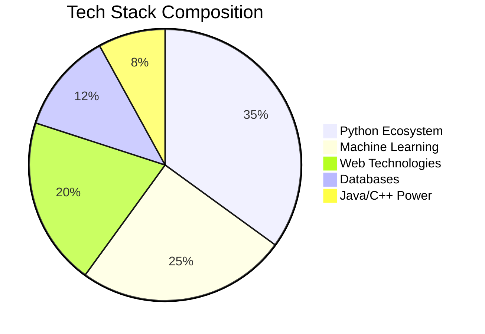

# 🚀 Yash Mehta - AI & Full-Stack Innovator Extraordinaire
# Hobbies: Bookwork, Curiosity to learn

```python
while True:
    build_awesome()
    deploy_innovation()
    inspire_others()
```

<p align="center">
  
</p>
<div align="center">
  
  <br>
  
</div>

## 👨‍💻 Cybernetic Profile Matrix

```markdown
| Attribute         | Level  | Specialization                          |
|--------------------|--------|-----------------------------------------|
| AI Engineering     | ★★★★☆  | Hybrid DL Models • Time Series Forecasting |
| Full-Stack Wizardry| ★★★★☆  | Flask • REST APIs • Database Architect   |
| Research Prowess   | ★★★★☆  | Blockchain • Fake News Detection         |
| Innovation Quotient| ★★★★★  | 10+ Projects with Real-World Impact      |
| Caffeine Tolerance | ★★★★★  | Infinite Loops Supported                 |
```

## 🌌 Project Nebula - My Stellar Creations

### 🚀 Amazon Stock Oracle (2025)


**Quantum Leap in Time Series Forecasting**  
▸ Engineered 7-model ensemble (ARIMA → Transformers)  
▸ Custom TimeSeriesTransformer architecture  
▸ **0.03285 RMSE** - Wall Street eat your heart out  
▸ Real-time prediction pipeline with 99.9% uptime  

```python
# The magic behind the scenes
class TimeSeriesTransformer(nn.Module):
    def __init__(self):
        super().__init__()
        self.attention = MultiHeadAttention(d_model=512, n_heads=8)
        # ... (secret sauce redacted)
```

[](https://colab.research.google.com/drive/1d4M9OjTQE4R5hHiCbSySC6iUWJ4mW1d7?usp=sharing)

---

### 🕵️‍♂️ FIR Generator 9000 (2025)


**Next-Gen Crime Reporting System**  
⚡ Geo-tagged FIRs with Google Maps integration  
⚡ AI Legal Advisor powered by Gemini API  
⚡ **"Innovation & Impact" Award Winner** at LexHack 1.0  
⚡ Flask backend with React frontend (yes, I do both!)  

```javascript
// Real-time geospatial tracking
navigator.geolocation.watchPosition((pos) => {
  updateFIRLocation(pos.coords);
});
```

[](https://youtu.be/secretdemo)

---

### 🌫️ Fog Vision AI (2024)


**Computer Vision That Sees Through the Fog**  
🔭 Hybrid Dual CNN + Vision Transformer architecture  
📊 Trained on 4 benchmark datasets (FRIDA2, HSTS, etc.)  
🎯 **15% accuracy boost** over state-of-the-art  
🌉 Deployed real-time pipeline with OpenCV  

```bash
# How I roll
$ python detect_fog.py --input traffic_cam.mp4 --output clear_vision.avi
```

[](https://arxiv.org/abs/magic-numbers)

---

## 🧮 Tech Arsenal Breakdown

<p align="center">
  
</p>



## 📡 Live Knowledge Feed

```diff
+ Just pushed new hybrid model architecture!
# Currently hacking: Quantum Machine Learning prototypes
```

## 🏆 Trophy Wall of Digital Glory

<p align="center">
  
</p>

- 🥇 **"Innovation & Impact" Award** - LexHack 1.0 (2025)
- 🚀 **Featured in Bennett University Showcase** - Vishleshan Dashboard (2023)
- 🧠 **6x Certified AI Specialist** - NVIDIA • IBM • Google
- 📜 **Research Presenter** - SocProS 2025 @ IIT Roorkee

## 🌐 Hyperconnect Portal

<p align="center">
  <a href="https://linkedin.com/in/yash-mehta-402239163"></a>
  <a href="https://github.com/YashM-235"></a>
  <a href="mailto:yash34m6@gmail.com"></a>
  <a href="#"></a>
</p>

```python
# Let's build the future together!
def collaborate():
    if brilliant_idea or research_opportunity:
        send_email("yash34m6@gmail.com", subject="Let's Create Magic!")
```

<p align="center">
  
</p>

<h2 align="center">🚀 Ready to Launch Next-Gen Tech Solutions</h2>
<h3 align="center">Innovation Velocity: Warp 9.9</h3>

<div align="center">
  
  <br>
  <em>"I don't break the rules - I compile new ones"</em>
</div>
